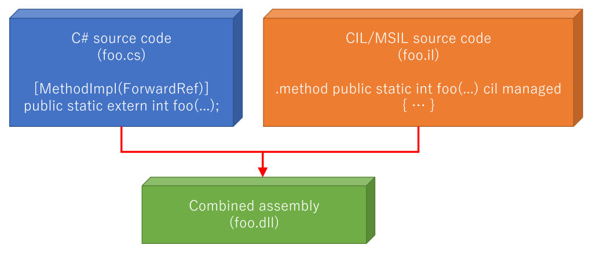
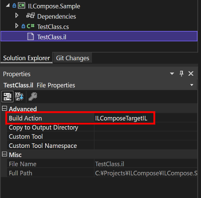

# ILCompose


[](https://www.repostatus.org/#active)
[](https://www.nuget.org/packages/ILCompose)
[](https://github.com/kekyo/ILCompose/actions?query=branch%3Amain)

----

## What is this?

Compose partially implementation both .NET language and IL assembler.
An improved implementation of the principles of [ILSupport](https://github.com/ins0mniaque/ILSupport).
If you are looking for an inline assembler for CIL/MSIL, here is a realistic solution.

In sample.cs:

```csharp
namespace IL2C.BasicTypes
{
    public class System_Boolean
    {
        // Refer IL assembly
        [MethodImpl(MethodImplOptions.ForwardRef)]
        public static extern bool ValueTypeTest();
    }
}
```

In sample.il:
```
.class public IL2C.BasicTypes.System_Boolean
{
    .method public static void ValueTypeTest() cil managed
    {
        .maxstack 2
        ldc.i4.s 123
        box bool

        ; ...

        ret
    }
}
```

These source code compose into one assembly by ILCompose.
Semantically, it is similar to the C# partial class definition, but it does this at the CIL level.



All CIL assemble source code (*.il) are automatically assembled by official dotnet IL assembler `ILAsm`.

Only you have to do install the NuGet package [ILCompose](https://www.nuget.org/packages/ILCompose) and ready to use!

----

## Environments

Supported target platforms:

* .NET 6, 5
* .NET Core 3.1 to 2.0 (maybe to 1.0)
* .NET Standard 2.1, 2.0 (maybe to 1.0)
* .NET Framework 4.8 to 2.0 (maybe to 1.0)

Supported building platforms:

* dotnet SDK 6, 5, 3.1, 2.2 and 2.1 (on Windows and Linux)
* .NET Framework 4.8 to 4.6.2 on Windows (With dotnet SDK installation)

----

## How to use

In short example:

```bash
$ dotnet new console
$ dotnet add package ILCompose

[Then write your code both *.cs and *.il ...]
```

See fully sample code:

* [Basic project](samples/ILCompose.Sample/)
* [Applied unit test project](samples/ILCompose.UnitTestSample/)

----

## Insight

ILSupport is cumbersome because it requires custom build scripts to be incorporated into the your project.
However, ILCompose is simply installation the NuGet package and builds everything automatically.

When you install the NuGet package,
the CIL (*.il) file will have the `ILComposeTargetIL` build action set as follows:



Basically, it can be used in the same way as ILSupport.

ILSupport is realized using ILDasm and a string substitution technique.
While ILCompose is realized using cecil, so the internal implementations are completely different.

Here is where the problem was in ILSupport.
The following C# code with the `forwardref` attribute applied cannot apply the additional custom attributes
(they must be written on the IL assembly source code side):

```csharp
// Refer IL assembly, all additional custom attribute will silently remove by ILSupport.
[MethodImpl(MethodImplOptions.ForwardRef)]
public static extern bool ValueTypeTest();
```

It allows you to apply custom attributes normally, as shown below:

```csharp
// Refer IL assembly with custom attributes
[Test]
[Description("A value type test.")]
[MethodImpl(MethodImplOptions.ForwardRef)]
public static extern void ValueTypeTest();
```

### Automatic adjusting assembly references.

When assembling your loose IL source code with implicit referenced assemblies,
`ILAsm` will cause these warnings below:

```
warning : Reference to undeclared extern assembly 'netstandard'. Attempting autodetect
warning : Reference to undeclared extern assembly 'System.Runtime'. Attempting autodetect
warning : Reference to undeclared extern assembly 'mscorlib'. Attempting autodetect

...
```

See also: [dotnet/runtime: ilasm cannot compile against different corlib names](https://github.com/dotnet/runtime/issues/7758)

ILCompose has no control these warning on `ILAsm`,
but ILCompose will resolve these inconsistent references in the final composite assembly.
Finally, the primary assembly (the original output assembly of the project) is aggregated into referenced assemblies.
For example, `mscorlib.dll` for `net48` and `System.Runtime.dll` for `net6.0`.

This feature is disabled `<ILComposeAdjustAssemblyReferences>false</ILComposeAdjustAssemblyReferences>` in `<PropertyGroup>` element.

----

## Limitation

* `<DebugType>` `embedded` is not supported.
* If no corresponding forwardref method is defined for a CIL method on the source code, that CIL method will not be composed.

----

## Background

This project was created in [IL2C](https://github.com/kekyo/IL2C.git),
there was a need for IL code management.
In IL2C, CIL unit test code was composed into .NET assemblies using ILSupport, but:

* The portion of [NUnit](https://nunit.org/) that relies on
  [Custom attributes extensions](https://docs.nunit.org/articles/nunit/extending-nunit/Custom-Attributes.html) has
  caused problems on the JetBrains Rider's test explorer, and I wanted to eliminate this. I was thinking of stopping the use of custom attributes extensions.
* In that case, needed to resolve a problem with custom attributes being removed
  by the `forwardref` attribute in ILSupport.
* To begin with, the ILSupport script was being used with considerable modifications, which caused maintainability problems.

Related: [IL2C issue #100: Will upgrade basis environments.](https://github.com/kekyo/IL2C/issues/100)

Therefore, I developed this package as a general-purpose package.

----

## License

Copyright (c) Kouji Matsui (@kozy_kekyo, @kekyo@mastodon.cloud)

License under Apache-v2.
